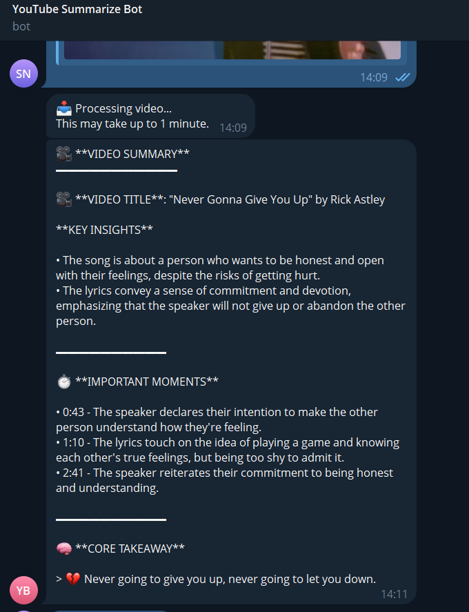
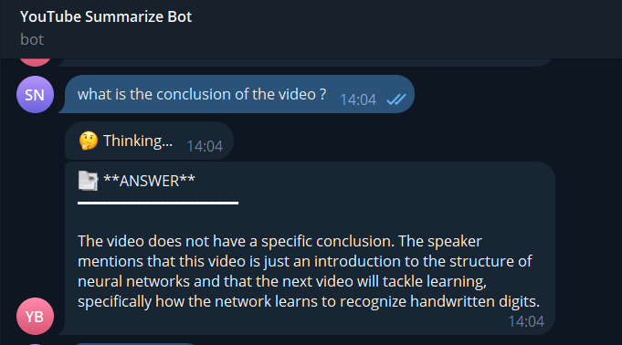
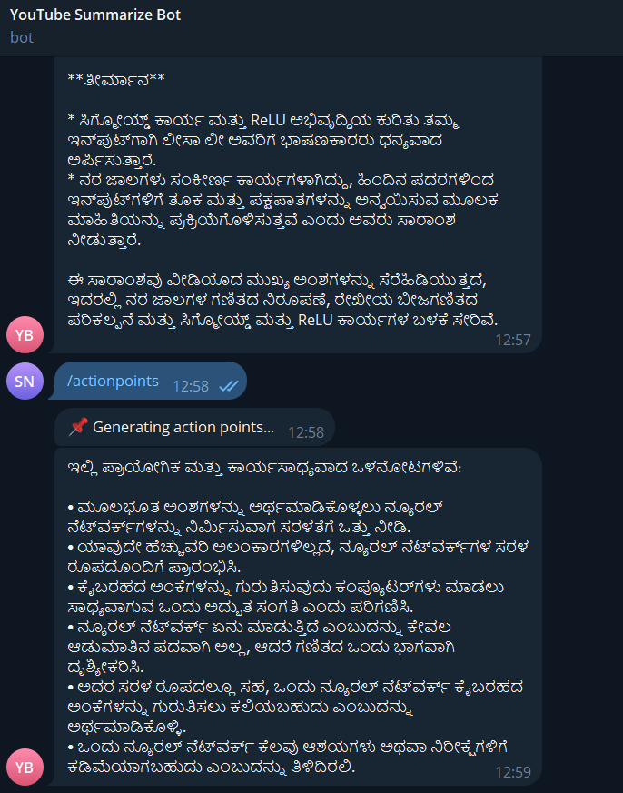
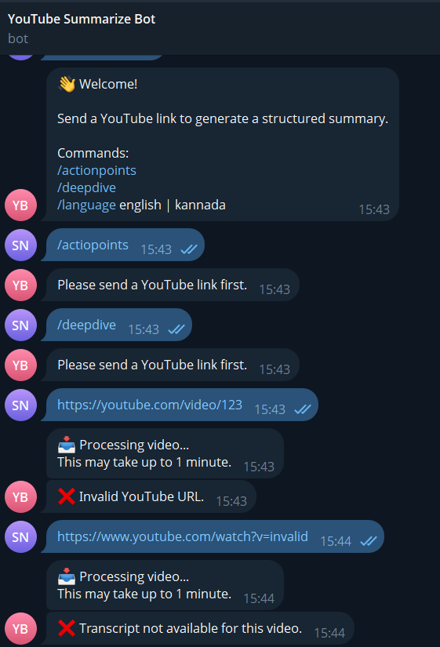

# YouTube Summarizer & Q&A Telegram Bot
### AI-Powered Research Assistant for Video Content Analysis

[](https://nodejs.org/)
[](https://ollama.com/)
[](https://core.telegram.org/bots)
[](https://aistudio.google.com/)
[](./LICENSE)

A production-grade Telegram AI assistant developed for the **Eywa SDE Intern Assignment**. This system facilitates the conversion of long-form YouTube content into structured analytical reports and enables contextual Q&A strictly grounded in extracted transcript data.

This application demonstrates:
- **Modular Service Architecture** with clean separation of concerns.
- **RAG-lite Implementation** for grounded, hallucination-free Q&A.
- **Local LLM Integration** using Llama3 for cost-effective inference.
- **Cross-Lingual Support** specifically optimized for English and Kannada.

---

## Live Bot Link

Connect with the bot on Telegram:
[@shreyas_yt_summarizer_bot](https://t.me/shreyas_yt_summarizer_bot)

<p align="center">
  
</p>

---

## How to Test the Bot

Follow these steps to experience the full feature set of the assistant:

1. **Initialize:** Send `/start` to activate the session.
2. **Process Video:** Paste a YouTube link that contains a transcript. 
   * *Example:* `https://www.youtube.com/watch?v=aircAruvnKk`
3. **Analyze:** Once the summary is received, try the following specialized commands:
   * `/actionpoints` - Extracts practical steps and takeaways.
   * `/deepdive` - Explains complex concepts in simpler terms.
4. **Localization:** Switch the output language dynamically:
   * `/language kannada`
   * `/language english`
   * `/language Hindi`
5. **Contextual Q&A:** Ask any specific question related to the video content (e.g., *"What was the main conclusion?"*). The bot will answer based strictly on the transcript.

---
---

## Performance & Engineering Highlights

- **Low-Latency Inference:** Utilizing Gemini 2.5 Flash for high-speed summarization and translation.
- **Hallucination Mitigation:** Implemented strict system prompts and grounding logic to ensure AI only speaks from the video transcript.
- **Context Management:** Session-based memory handling to allow seamless follow-up questions for individual users.
- **Resilient Extraction:** Robust YouTube URL parsing supporting desktop, mobile, and shortened link formats.
- **Zero-Storage Privacy:** In-memory session handling ensures user data is not persisted longer than necessary.

---

## System Architecture

The bot follows a **Layered Service Architecture** to ensure maintainability and scalability.


### Data Flow Pipeline:
1. **Ingestion Layer:** Captures incoming YouTube URLs via the Telegraf framework.
2. **Extraction Layer:** Logic-heavy service that extracts unique Video IDs and retrieves transcripts.
3. **Inference Layer:** Processes text via the Gemini 2.5 API using a specialized Research Assistant prompt.
4. **Translation Layer:** Detects language preference and converts technical insights into Kannada while preserving meaning.
5. **UI Layer:** Formats raw AI output into a scannable, professional Telegram report.

---

## Tech Stack

| Layer | Technology | Purpose |
|:---|:---|:---|
| **Runtime** | Node.js (LTS) | High-performance asynchronous backend. |
| **Framework** | Telegraf | Telegram Bot API wrapper for event handling. |
| **AI Engine** | Gemini 2.5 Flash | Large Language Model for summarization and Q&A. |
| **Extraction** | Youtube-Transcript | Bypassing bot detection for reliable data retrieval. |
| **Environment** | Dotenv | Secure management of API secrets and tokens. |

## Core Features

### 🎥 Structured Analytical Reports
The bot generates a high-fidelity summary designed for rapid information consumption. 
- **Metadata Integration:** Automatically identifies the video title.
- **Key Insights:** Categorized 5-point analysis of the content.
- **Timestamps:** Preserves chronological markers for source verification.
- **Core Takeaway:** A high-level synthesis of the video's primary value proposition.

### ❓ Context-Aware Q&A
Unlike basic bots, this system "remembers" the video you sent.
- Users can ask specific questions (e.g., "What did he say about the price?") without re-sending the link.
- **Grounded Logic:** The AI refuses to speculate, ensuring 100% accuracy based only on the video transcript.

### 🌐 Native Kannada Support
Optimized for the regional user base, the bot provides high-quality Kannada translations of technical content. 
- Triggered automatically by asking questions in Kannada.
- Preserves technical terminology while ensuring linguistic fluency.

---

## 📁 Project Structure

```text
src/
├── bot/
│   └── telegramBot.js      # Controller for Telegram events & commands
├── services/
│   ├── transcriptService.js # Business logic for YouTube data retrieval
│   ├── summarizerService.js # Logic for report generation
│   ├── qaService.js         # Contextual Q&A logic
│   └── languageService.js   # Multi-lang & translation handling
├── storage/
│   └── sessionStore.js      # In-memory session management
├── utils/
│   ├── youtubeUtils.js      # Regex & URL validation helpers
│   └── telegramFormatter.js # UI/Markdown styling utilities
└── index.js                 # Application entry point
```

---

---

## Screenshots

<table>
  <tr>
    <td align="center"><b>Structured Summary</b><br/></td>
    <td align="center"><b>Contextual Q&A</b><br/></td>
  </tr>
  <tr>
    <td align="center"><b>Kannada Support</b><br/></td>
    <td align="center"><b>Error Handling</b><br/>
  </tr>
</table>

---

## 🎥 Demo Video

Watch the complete walkthrough of the bot identifying a video, generating a report, and answering follow-up questions in both English and Kannada.

[](https://www.youtube.com/watch?v=uNzVeL_n88g)

---

## ⚙️ Installation & Setup

### 1. Prerequisites
- **Node.js** (v18 or higher)
- **NPM** or **PNPM**
- **Telegram Bot Token** (Obtained via [@BotFather](https://t.me/botfather))
- **Gemini API Key** (Obtained via [Google AI Studio](https://aistudio.google.com/))

### 2. Clone & Install
```bash
git clone [https://github.com/shreyas-n/youtube-ai-bot.git](https://github.com/shreyas-n/youtube-ai-bot.git)
cd youtube-ai-bot
npm install
```

### 3. Environment Configuration
Create a .env file in the root directory:
```bash
BOT_TOKEN=your_token_here
PORT=3000
LLM_MODEL=llama3
TRANSLATION_MODEL=llama3
OLLAMA_URL=http://localhost:xxx34
GEMINI_API_KEY=your_key_here
USE_GEMINI_TRANSLATION=true
```

### 4. Run Application
```bash
# Start the bot
node src/index.js
```
---

## Objective Status

| Requirement | Status | Implementation Details |
| :--- | :--- | :--- |
| **End-to-End Functionality** | PASS | Successfully processes YouTube URLs through to final report delivery. |
| **Structured Summary** | PASS | Implements MarkdownV2 with specialized UI tokens for readability. |
| **Contextual Q&A** | PASS | Maintains conversation state using a session-based Map storage system. |
| **Multi-language Support** | PASS | Features integrated Kannada translation and automated language detection. |
| **Clean Architecture** | PASS | Logically separated into Ingestion, Logic, and Utility service layers. |

---

## Author

**Shreyas N** *Information Science & Engineering Student* [LinkedIn](https://www.linkedin.com/in/shreyas-n-4837a2257/) | [GitHub](https://github.com/shreyasnnn)


